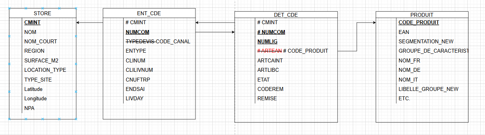
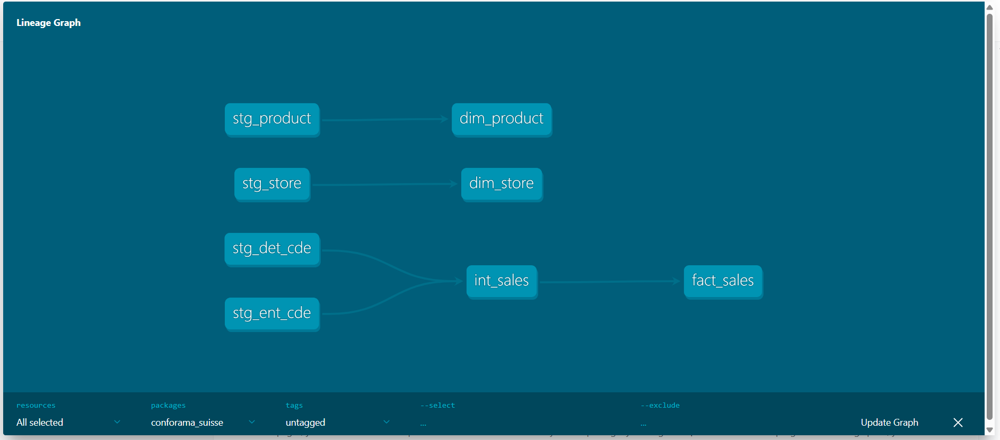
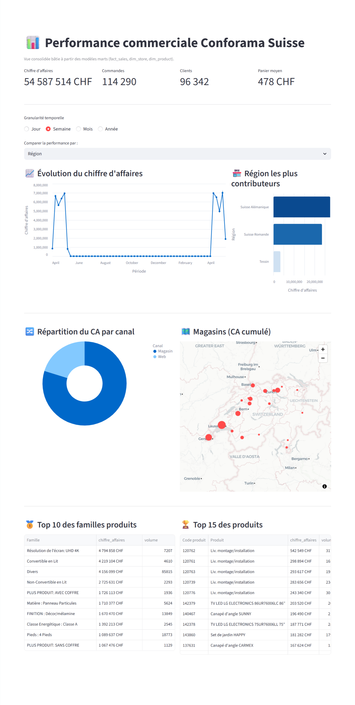

### How to Run the Repository

* Create and activate a local virtual environment (`python -m venv venv`, then `source venv/bin/activate` on macOS/Linux or `venv\\Scripts\\activate` on Windows) and install the dependencies: `pip install -r requirements.txt`.
* **DBT + DuckDB**

  1. `cd RetailStore_suisse`
  2. Run `dbt debug` to check the included DuckDB configuration.
  3. Run `dbt run`
* **Streamlit**: from the same directory, run `streamlit run dashboard.py`. The app directly reads the DuckDB/dbt outputs generated in the previous step and exposes the KPIs.

---

### Expected Response

**Approach**
I started by understanding the provided datasets. To do this, I produced a Logical Data Model (LDM) to visualize the relationships between sources and identify unclear areas. This phase helped me clarify naming conventions (e.g. the foreign key in `det_cde`: `ARTEAN` → `product_code`).

Once the scope was defined, I built a complete ELT pipeline using dbt + DuckDB, which is well suited for this use case.

**Proposed Data Structure**

* **Staging layer**: data type harmonization, cleaning (`TRY_CAST`), and standardized naming.
* **Intermediate layer**: joining order headers and order lines to build the raw fact table and enrich metrics (quantities, gross revenue incl. VAT, VAT amounts, statuses).
* **Marts layer**: star schema modeling around `fact_sales` and the dimensions `dim_product`, `dim_store`, and `dim_date`.

**Visualization / KPIs**
For the purpose of this exercise, I chose a Streamlit application, lightweight and easy to run locally. The dashboard displays the requested KPIs (gross revenue incl. VAT, quantities sold, channel breakdown, top products/stores) using cards and charts.

> A video recording of the dashboard is available in the `record` folder.

---

**Time Spent**
4h 10m.
